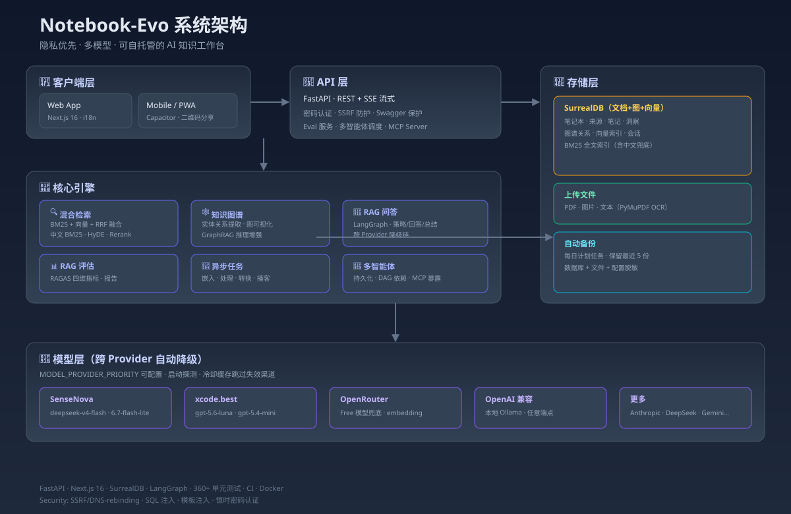

<div align="center">

# Notebook-Evo · AI 知识工作台

**隐私优先 · 多模型 · 可自托管的 AI 知识工作台**

基于 [Open Notebook](https://github.com/lfnovo/open-notebook)（MIT）深度增强的个人知识库与 AI 内容生产平台。

上传研究资料 → AI 问答 / 混合检索 / 图谱推理 / 内容生成，构建你自己的知识工作流。


📥 **下载项目简历 PDF**：[project-showcase.pdf](open-notebook/docs/project-showcase.pdf)

📱 **在线体验**：见 [部署说明](#-在线体验) | 二维码：[docs/demo-qr.png](open-notebook/docs/demo-qr.png)

</div>

---

## 📋 项目结构

```
notebook-evo/
├── open-notebook/          # 核心应用（后端 + 前端，本增强版）
│   ├── api/                # FastAPI 后端（REST + SSE）
│   ├── open_notebook/      # 领域层（检索 / 图谱 / 图谱 / RAG 评估）
│   ├── frontend/           # Next.js 16 前端（14 种语言）
│   ├── commands/           # 异步任务（嵌入 / 处理 / 转换）
│   └── tests/              # 360+ 单元测试
├── docs/                   # 架构 / 部署 / 使用文档
├── scripts/                # 运维脚本（备份 / 一键演示 / 健康检查）
└── mobile-app/             # 移动端打包（Capacitor）
```

## 🏗️ 系统架构



> 完整架构图：[open-notebook/docs/architecture-diagram.svg](open-notebook/docs/architecture-diagram.svg)

## ✨ 技术亮点

### 🔍 混合检索（RAG 核心）
- **BM25 全文 + 向量语义双路召回，RRF 融合**，可选 Rerank
- **中文检索增强**：jieba 分词 + rank_bm25 兜底（SurrealDB 原生 analyzer 无法处理中文）
- **高级检索**：HyDE 假设文档嵌入、语义缓存、自适应路由

### 🕸️ 知识图谱 + GraphRAG
- 实体关系提取 → 图可视化 → **图谱增强问答**（向量 + 图双路推理）
- 笔记本级图谱一键生成，模型不可用时自动降级到可用 provider

### 📊 RAG 评估中心
- **RAGAS 四维指标**（Faithfulness / Relevancy / Precision / Recall）自动评估回答质量
- 可视化报告，可对比不同模型 / 检索配置的效果

### 🤖 多智能体 + MCP
- 多智能体**状态跨重启持久化**，任务依赖 DAG 编排
- **MCP Server**：把知识库能力暴露为标准 MCP 工具，Claude / Cursor 可直接调用

### 🔐 安全工程
- SSRF / DNS 重绑定防护（拒绝 link-local + AWS IMDSv6）
- SurrealQL 注入修复（参数绑定）、Jinja2 模板注入修复
- **跨 Provider 模型降级**：主模型不可用时自动切换（xcode.best → SenseNova → OpenRouter），优先级可配置
- 密码认证（恒时比较）+ Swagger 文档保护

### ⚡ 运维与工程化
- **CI**：lint + test（360+ 测试）
- **Docker 一键部署**、Windows 一键演示脚本
- 每日自动备份计划任务、健康检查自动重启
- **双端同步**：Tailscale 内网穿透，手机电脑访问同一知识库

## 📱 在线体验

公开演示通过 Cloudflare 隧道提供（密码保护）：

| 渠道 | 地址 |
|------|------|
| 🌐 公网 | `https://barriers-geometry-operate-station.trycloudflare.com` |
| 📶 局域网 | `http://LAN_IP_PLACEHOLDER:8889` |
| 🔒 Tailscale | `http://TAILSCALE_IP_PLACEHOLDER:8889` |

**手机扫码**：[](https://barriers-geometry-operate-station.trycloudflare.com)

> 访问密码：`REPLACED_SEE_LOCAL_CREDENTIALS`（在 `E:\notebook\open-notebook\.env` 中修改）

> ⚠️ 隧道域名重启后会变：运行 `powershell -File E:\notebook\scripts\get-tunnel-url.ps1` 查询最新地址

### 截图（待替换）

> 启动 `E:\notebook\open-notebook\frontend && npm run dev` → 浏览器登录后用截图工具（F12 → Capture screenshot）替换以下占位图：

| 截图位置 | 占位图 |
|----------|--------|
| 笔记本列表 |  |
| 系统健康 |  |
| RAG 问答 |  |
| 知识图谱 |  |

## 🚀 快速开始

```bash
# 方式一：Docker（2 分钟）
docker compose -f open-notebook/docker-compose.self.yml up -d
# 打开 http://localhost:8502

# 方式二：源码运行（Python 3.12+）
cd open-notebook
uv sync
./surreal.exe start --user root --pass root --bind 127.0.0.1:8000 rocksdb:./surreal_data/db
.\.venv\Scripts\python.exe run_api.py

# 方式三：Windows 一键演示
start-demo.bat
```

## ⚙️ 配置 AI 模型

支持 **20+ 模型提供商**（OpenAI / Anthropic / DeepSeek / SenseNova / xcode.best / OpenRouter / 本地 Ollama ...）。

Web UI → Models → 添加配置 → 填入 API Key → Test → Sync Models → Auto-Assign Defaults。

## 🧪 测试与质量

```bash
# 后端 360+ 测试
uv run pytest tests/ -v

# 前端测试 / Lint
cd frontend && npm test && npm run lint
```

## 📚 文档

| 文档 | 说明 |
|------|------|
| [架构文档](open-notebook/docs/architecture.md) | 系统架构、数据流、技术决策 |
| [MCP 接入指南](open-notebook/docs/mcp-server.md) | 接入 Claude / Cursor |
| [双端同步](open-notebook/docs/mobile-sync.md) | Tailscale 手机电脑访问 |
| [测试与验收](open-notebook/docs/qa.md) | 三层测试体系 |

## 🏗️ 技术栈

| 层 | 技术 |
|----|------|
| 后端 | Python 3.12 · FastAPI · LangGraph · SurrealDB · Esperanto |
| 前端 | Next.js 16 · React 19 · Tailwind · shadcn/ui |
| 检索 | BM25 · 向量 · RRF · Rerank · HyDE |
| 部署 | Docker · CI/CD · Windows 一键脚本 |

## 📄 许可

MIT License（继承上游 [Open Notebook](https://github.com/lfnovo/open-notebook)）。
